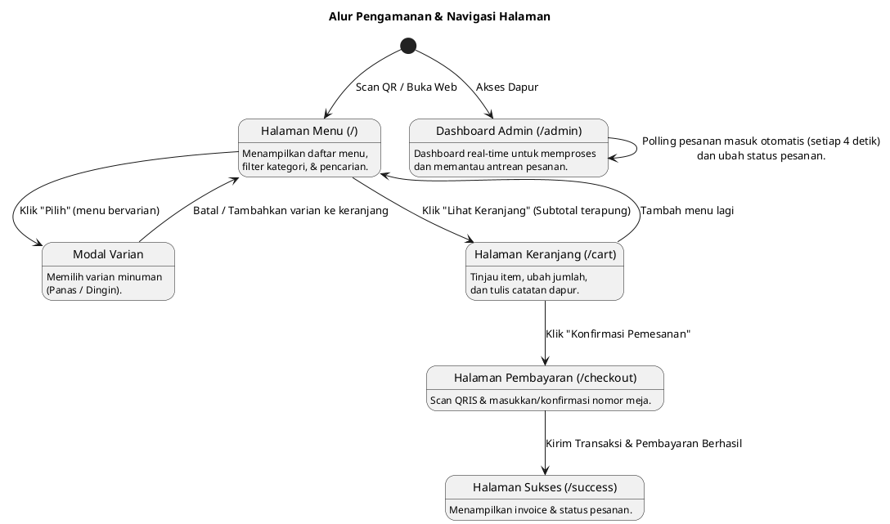
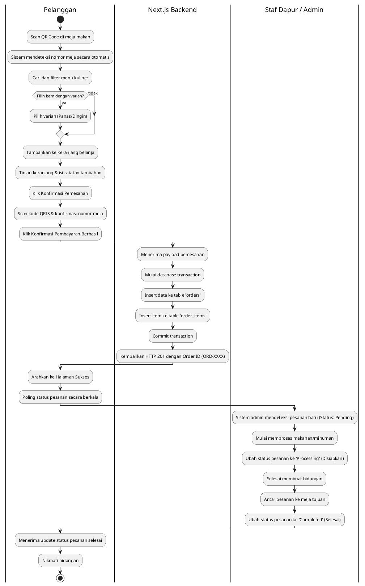
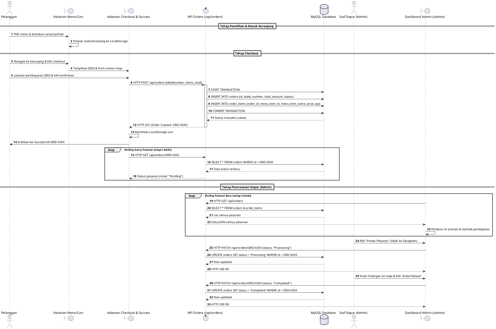
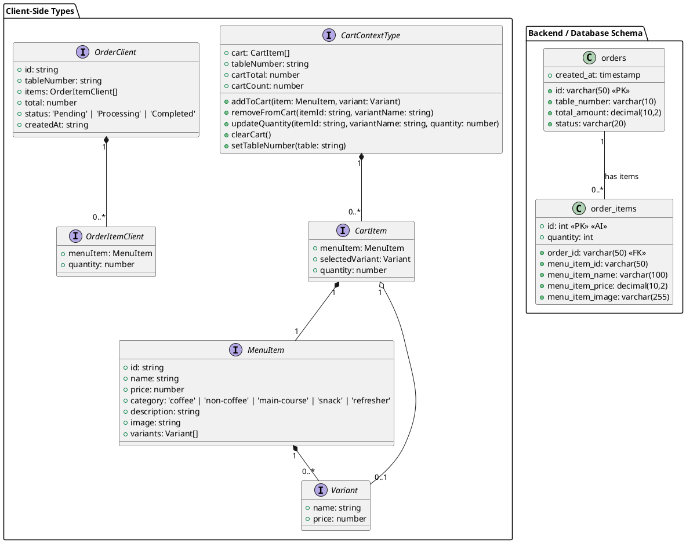
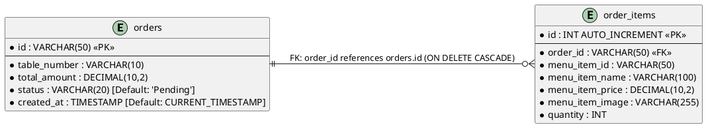

# Dokumentasi Project: Cafe QR Ordering System (Warkop Asta)

Sistem Pemesanan Menu Berbasis QR Code untuk **Warkop Asta** menggunakan **Next.js 14 (App Router)**, **TypeScript**, **Tailwind CSS**, dan **MySQL**.

---

## 1. Pendahuluan
**Warkop Asta** adalah aplikasi web pemesanan mandiri berbasis QR Code. Pelanggan cukup memindai kode QR yang berada di meja makan untuk membuka aplikasi, memilih menu makanan/minuman, menyesuaikan varian (suhu/harga), memasukkan ke keranjang belanja, mengisi catatan tambahan untuk dapur, dan melakukan pembayaran instan secara mandiri menggunakan QRIS. Setelah pembayaran diverifikasi, pesanan masuk ke dashboard admin dapur secara real-time untuk diproses dan disajikan.

---

## 2. Diagram Use Case (Use Case Diagram)
Diagram ini menjelaskan interaksi aktor utama (Pelanggan dan Staf Dapur/Admin) dengan sistem.

```plantuml
@startuml UseCaseDiagram
skinparam handwritten false
skinparam monochrome false
skinparam packageStyle rect
skinparam defaultFontName "Courier New"

actor "Pelanggan" as customer
actor "Staf Dapur / Admin" as admin

rectangle "Sistem QR Ordering Warkop Asta" {
  usecase "Pindai QR & Deteksi Meja" as UC_ScanQR
  usecase "Cari & Filter Menu Kuliner" as UC_BrowseMenu
  usecase "Pilih Menu & Varian (Panas/Dingin)" as UC_SelectVariant
  usecase "Kelola Keranjang Belanja" as UC_ManageCart
  usecase "Tulis Catatan Kustom untuk Dapur" as UC_AddNotes
  usecase "Bayar via QRIS (Verifikasi Otomatis)" as UC_PayQRIS
  usecase "Pantau Status Pesanan (Real-time)" as UC_TrackStatus
  
  usecase "Pantau Antrean Pesanan (Real-time Polling)" as UC_MonitorOrders
  usecase "Proses & Ubah Status Pesanan" as UC_UpdateStatus
  usecase "Lihat Ringkasan Statistik Penjualan" as UC_ViewStats
}

customer --> UC_ScanQR
customer --> UC_BrowseMenu
customer --> UC_SelectVariant
customer --> UC_ManageCart
customer --> UC_AddNotes
customer --> UC_PayQRIS
customer --> UC_TrackStatus

admin --> UC_MonitorOrders
admin --> UC_UpdateStatus
admin --> UC_ViewStats
@enduml
```



---

## 3. Diagram Alur Pengguna (User Flow Diagram)
Menunjukkan navigasi halaman dari sisi Pelanggan maupun Admin.



---

## 4. Diagram Aktivitas (Activity Diagram)
Menjelaskan langkah logis alur transaksi pemesanan dari mulai memindai QR sampai pesanan disajikan.



---

## 5. Diagram Sekuens (Sequence Diagram)
Menunjukkan pertukaran pesan antar komponen web selama proses pemesanan dan pemrosesan pesanan.



---

## 6. Diagram Kelas (Class Diagram)
Representasi struktur objek data (model) pada client-side (Next.js/React Context) dan backend server.



---

## 7. Diagram Arsitektur (Architecture Diagram)
Diagram arsitektur sistem modular yang digunakan dalam project Next.js.

```plantuml
@startuml ArchitectureDiagram
skinparam defaultFontName "Courier New"

package "Client Layer (Frontend)" {
  component "Next.js Pages (Client Components)" as clientPages {
    [Halaman Menu (/)] as pageMenu
    [Halaman Keranjang (/cart)] as pageCart
    [Halaman Checkout (/checkout)] as pageCheckout
    [Halaman Sukses (/success)] as pageSuccess
    [Dashboard Admin (/admin)] as pageAdmin
  }
  
  component "State Management" as stateMgmt {
    [CartContext (React Context API)] as cartCtx
    [LocalStorage Web API] as localStorage
  }
  
  component "UI Components" as uiComp {
    [MobileFrame Layout] as mobFrame
    [StatusBadge] as badge
  }
}

package "Server Layer (Backend API)" {
  component "Next.js API Router (Serverless / Server-Side)" as serverAPI {
    [POST & GET /api/orders] as routeOrders
    [PATCH & GET /api/orders/[id]] as routeOrdersDetail
  }
  
  component "Database Connection & Migrations" as dbHelper {
    [lib/db.ts (initDb & executeQuery)] as dbConnect
  }
}

database "MySQL Database Service" as dbMySQL {
  folder "Database Tables" {
    [Table: orders] as tblOrders
    [Table: order_items] as tblOrderItems
  }
}

' Hubungan Client
pageMenu --> cartCtx
pageCart --> cartCtx
pageCheckout --> cartCtx
cartCtx <-> localStorage : "Persist Cart State"

pageMenu --|> mobFrame
pageCart --|> mobFrame
pageCheckout --|> mobFrame
pageSuccess --|> mobFrame
pageAdmin --|> badge

' Hubungan Client ke Server API via Fetch
pageCheckout --> routeOrders : "HTTP POST"
pageSuccess --> routeOrdersDetail : "HTTP GET (Polling status)"
pageAdmin --> routeOrders : "HTTP GET (Polling list)"
pageAdmin --> routeOrdersDetail : "HTTP PATCH (Update status)"

' Hubungan Server API ke Database
routeOrders --> dbConnect : "Query Exec"
routeOrdersDetail --> dbConnect : "Query Exec"
dbConnect --> tblOrders : SQL Queries
dbConnect --> tblOrderItems : SQL Queries

@enduml
```

---

## 8. Entity Relationship Diagram (ERD)
Hubungan database fisik antara tabel `orders` dan `order_items` beserta tipe data dan key constraints.



---

## 9. Struktur Folder Project
Berikut adalah penjelasan singkat struktur berkas project:

*   `/app`: Routing utama Next.js (App Router).
    *   `/app/page.tsx`: Halaman katalog menu pelanggan.
    *   `/app/cart/page.tsx`: Halaman keranjang belanja pelanggan.
    *   `/app/checkout/page.tsx`: Halaman scan QRIS dan konfirmasi nomor meja.
    *   `/app/success/page.tsx`: Halaman status penyelesaian pesanan & invoice.
    *   `/app/admin/page.tsx`: Panel dashboard real-time dapur dan statistik staf.
    *   `/app/api/orders`: Endpoint API untuk mengambil dan membuat pesanan.
    *   `/app/api/orders/[id]`: Endpoint API untuk mengambil detail dan mengubah status pesanan.
*   `/components`: Komponen UI reusable seperti `MobileFrame` dan `StatusBadge`.
*   `/context`: `CartContext.tsx` untuk mengelola state belanjaan pelanggan di sisi klien.
*   `/data`: `menu.ts` yang menyimpan database katalog makanan dan minuman statis.
*   `/lib`: `db.ts` yang berisi inisialisasi pool koneksi MySQL dan skema migrasi otomatis.
*   `.env.local` / `.env.production`: Konfigurasi variabel lingkungan untuk koneksi database MySQL.
